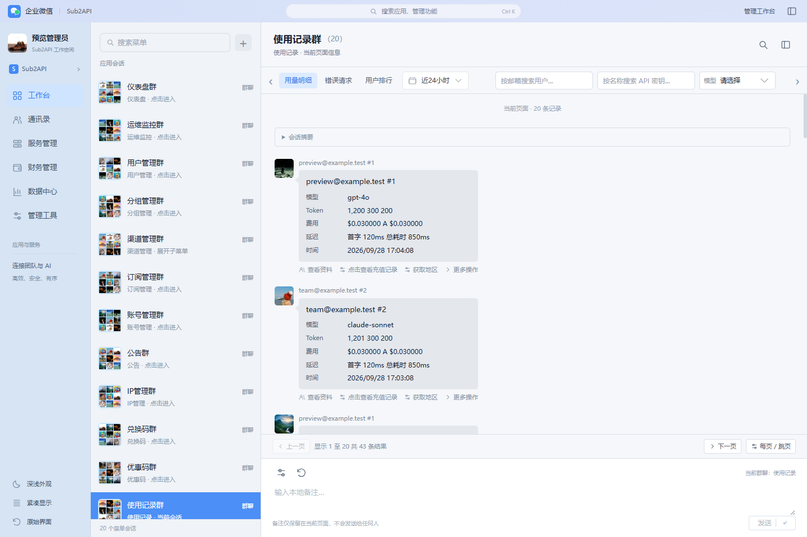

# Sub2API · 企业微信管理工作台

**v2.3.10 更新配置**：补齐 `@updateURL`、`@downloadURL`、`@homepageURL` 和 `@supportURL`。更新检测与下载均指向本仓库 `main` 分支中的构建脚本；将新版本提交并推送后，脚本管理器即可按其更新设置检测。已通过复制方式安装旧版本的用户，需先手动替换为本版并保存，以写入更新地址。

**v2.3.9 账号管理修复**：账号气泡直接展示当前页面提取到的全部资料，不再截取前 5 项，也不再需要“查看资料”。“查询”、编辑及状态切换直接触发原生操作，不会额外打开空白侧栏。移除皮肤生成的“更多操作”，保留原生“更多”菜单中的用量统计、定时测试等功能；新增独立“测试”按钮，打开对应账号的原生测试弹窗，由用户选择模型并开始测试。

本次将安装脚本 2.3.8 中已有的监控页、用户页和气泡布局改动同步回源码，避免重新构建覆盖已有功能。元数据、包版本与生成脚本统一为 2.3.9。

参考 `linuxdo-idea-ui/linuxdo-im.user.js` 的企业微信皮肤，为 Sub2API 管理员页面提供独立油猴脚本。**v2.3 将原生筛选直接放入“用量明细／错误请求”所在的单行工具栏，默认隐藏内容、hover 显示，始终保留 48px 占位**。中栏只展示原始菜单，右侧展示数据气泡；曲线、饼图等图表默认隐藏，文字统计保留。



## 安装

1. 在已安装 Tampermonkey / Violentmonkey 的浏览器中新建用户脚本。
2. 将本目录 **`sub2api-wecom.user.js` 的全部内容**复制进去并保存。
3. 刷新已登录的 Sub2API 管理员页面，例如 `/admin/accounts`。

构建产物已包含全部 CSS 和 JavaScript，安装不需要 Node.js 或 npm。修改源码以后才需要重新构建。

由于部署域名尚未提供，默认使用 `http://*/*` 和 `https://*/*` 匹配；脚本会进一步检查 `#app .app-layout`、`aside.sidebar`、原生管理链接和 `/admin/` 路由，全部符合才启用皮肤。建议在脚本头部将两个 `@match` 改成自己的站点，例如：

```js
// @match        https://sub2api.example.com/*
```

这里保留 `/*`，以支持从登录页经 Vue 路由进入管理页。仅匹配 `/admin/*` 会导致脚本无法在登录页的单页导航后启动。上面的域名是占位示例，需要替换。

## 复刻范围

| 部位 | 实现 |
| --- | --- |
| 桌面外框 | 40px 淡蓝渐变标题栏、162px 企业微信主导航、304px 会话列表、右侧聊天区 |
| 色彩和排版 | `#4389F5` 主色、`#D6E4F4` 导航底色、`#DCEBFF` 选中态、微软雅黑/苹方、紧凑字号和 5–8px 圆角 |
| 中间会话列表 | 只使用原始侧栏菜单，保持原菜单顺序，以九宫格群头像、两行摘要和蓝色选中态展示；不会插入模型、账号、用户或统计数据行 |
| 随机头像 | 构建时内嵌 `avator/` 中的 17 张图片；联系人随机分配，群聊使用 9 张不重复的图片拼成九宫格；列表、消息和页面刷新保持一致 |
| 右侧聊天区 | 80px 会话标题栏、34px 消息头像、昵称、灰色信息气泡、气泡尾巴、消息操作、底部输入区；个人资料和群信息从真实页面提取 |
| 管理操作 | 同一条工具栏直接显示日期、搜索、下拉筛选、刷新、导出、列设置和批量操作，已取消“筛选与工具”侧面板入口 |
| 分页与排序 | 聊天区直接翻页、显示真实总数；工具栏包含排序、每页条数等原生控件，底部入口可定位对应控件 |
| 使用记录 | 用量明细／错误请求／用户排行入口复用原切换逻辑；按当前 tab 读取记录，不混入隐藏 tab 或图表附属统计表 |
| 图表与统计 | 隐藏图表及对应图表卡片，日期等业务筛选保留；文字指标显示在可展开的“会话摘要”中 |
| 搜索 | 中栏只搜索菜单；工具栏包含原生业务搜索和当前已加载内容查找，二者用途独立；`Ctrl+K` / `⌘+K` 打开应用搜索 |
| 显示选项 | 深浅色使用 Sub2API 原有开关；紧凑会话密度；会话列表收起 |
| 响应式 | 窄桌面主导航变成图标栏；手机使用会话列表 → 聊天详情的两级布局，可返回会话列表 |
| 恢复 | 离开 `/admin/` 自动恢复原界面；支持暂停皮肤与保存显示偏好 |

参考项目的会话列表在这里对应原始菜单，聊天详情对应所选菜单的页面数据。原始后台页面在默认视图中隐藏，保留其 Vue 生命周期与事件；脚本从已渲染 DOM 提取字段，重新生成右侧消息气泡。筛选控件通过样式定位到工具栏占位上，实际 DOM 父子关系保持不变，不复制组件、不移动 Vue 节点、不重写业务请求。原组件的输入联动、校验、权限、确认弹窗和导出处理继续生效。

工具栏内容使用透明度隐藏，行高始终为 48px，鼠标移入／移出不会让消息区上下跳动。键盘聚焦、正在输入或下拉框展开时持续显示；触屏设备没有 hover 时显示控件。较多筛选项使用单行横向滚动，两端箭头可翻看后面的筛选和操作。

## 功能入口

| 需要做什么 | 主题里的入口 |
| --- | --- |
| 使用记录按用户／API Key／账号／模型／分组等过滤 | 鼠标移入工具栏，直接使用原搜索框、下拉框和候选列表 |
| 日期范围、刷新、重置、列设置、导出 | 同一工具栏中的原控件；超出宽度时向右滚动 |
| 切换用量明细、错误请求、用户排行 | 聊天区顶部标签 |
| 上下页、查看结果总数 | 聊天区底部；显示后端返回的真实分页摘要 |
| 每页条数、跳到指定页 | 底部“每页 / 跳页”打开原分页设置 |
| 排序 | 顶部“排序字段”和升序／降序按钮，触发原表头排序 |
| 勾选账号／用户并批量处理 | 气泡下方“选择” → 工具栏中的原批量操作 |
| 账号资料、查询、编辑、测试 | 资料直接显示；气泡下按钮触发原生操作，“测试”打开测试弹窗 |
| 账号的用量统计、定时测试等操作 | 气泡下“更多”打开原生菜单 |
| 其他页面的单条操作 | 气泡下原按钮；“更多操作”展示该条记录的原控件 |
| 复杂设置页面或未识别的自定义控件 | 保留原记录操作和编辑界面；仍不适配时使用左下角“原始界面” |

工具栏末尾的“查找当前列表”仍为本地已加载内容过滤，不替代后端筛选。需要跨页匹配时使用同一工具栏中的业务筛选。使用原生筛选、分页或排序时会清空本地过滤，避免双重过滤造成结果混淆。

气泡表示当前已加载页面的数据快照，不是实际用户发送的消息或历史审计记录。更换分页或筛选会更新右侧内容，中栏仍只保留原始菜单。头像取自用户提供的素材，随机分配，不代表账号持有人的真实头像。

## 日常使用

- 左侧分类筛选中栏菜单，点击“工作台”重新显示全部入口。
- 点击“账号管理群”等菜单会话，右侧显示对应页面的记录气泡。账号管理直接展示全部已提取字段；其他页面仍可点击“查看资料”查看详情，再点击当前菜单返回整页记录。
- 中栏“搜索菜单”只过滤菜单名称或路径；“＋”清空菜单搜索。已移除原来的“联系人”页签及联系人数量统计。
- 右侧标题下的“搜索当前列表”支持名称、ID、邮箱、平台、状态、备注等全部已显示字段。支持多关键词（以空格分隔，需同时匹配）、大小写不敏感；`×` 或 Esc 清空后恢复。
- 表格、移动端卡片、插件等卡片列表、普通列表均可使用通用搜索，即使原页面没有搜索输入框；该搜索位于横向工具栏末尾。
- 尚未加载的其他分页不会被本地查找自动请求。工具栏中的原生搜索、筛选继续使用后端匹配规则与范围。
- 本地筛选会隐藏不匹配的原生行，但不会更改后端的批量选择范围，因此筛选期间批量操作暂时不可用；清空搜索或使用原页搜索后恢复，单条编辑可正常使用。
- 点击顶栏搜索或使用 `Ctrl+K` / `⌘+K`。尚未展开的原生分组会显示“展开分组”，打开后即可选择子项。
- 点击右上角面板图标收起/展开中栏；“显示工具栏”会聚焦工具栏，不再打开额外的筛选面板。
- 账号气泡“查询”“编辑”等操作直接触发原来的事件；“测试”打开原生测试弹窗；“更多”显示原生菜单，不打开侧栏。其他页面的“更多操作”仍在侧面板中展示当前记录。
- 底部输入区支持本地备注，Enter 发送、Shift+Enter 换行；蓝色气泡仅在当前页面内存保留，刷新后消失，不发送给用户、不写入业务后端。输入 `/查找 名称` 搜索右侧页面记录。
- 点击左下角“紧凑显示”切换会话密度；偏好按站点保存在 `sub2api-wecom-v1`。
- 点击“原始界面”关闭换肤。重新启用：在油猴菜单中选择“企业微信皮肤：启用 / 关闭”。也可以直接停用用户脚本并刷新。
- 原生网站主题 `data-skin` 只在换肤期间暂停；退出管理路由或关闭皮肤时恢复。深浅色仍同步原生开关。

## 本地预览与开发

```powershell
cd D:\allMyFile\code\personalProject\sub2api-theme\sub2api-wecom
npm run build
npm run check
npm test
npm run preview
```

打开 `http://127.0.0.1:4178/admin/accounts`。该独立演示页使用模拟数据，支持搜索、筛选、勾选、弹窗和仪表盘切换；其他菜单仅作为视觉导航占位，不实现对应的真实业务。演示页无需安装依赖。

测试优先使用本项目的 `jsdom`，若未安装则复用同级 `sub2api/frontend/node_modules` 中的已有依赖。独立使用本项目时先执行 `npm install`。

真实 Vue 源码联调：

```powershell
npm run preview:native
# http://127.0.0.1:4179/admin/accounts
```

该模式读取同级 Sub2API 的真实前端源码和已安装的 Vite/Vue/Tailwind 依赖，仅在本项目 `.native-cache` 内保存预览缓存。所有 API 请求由本地模拟接口处理，没有代理到真实后端。仅提供账号/用户等基础视觉联调数据；业务写入统一拒绝，统计批量读取使用空模拟结果。此模式不用于验证业务接口正确性。

如果原项目在其他目录，设置 `$env:SUB2API_FRONTEND` 为它的 `frontend` 绝对路径。两个预览服务均仅监听 `127.0.0.1`，通过 `Ctrl+C` 停止。

## 头像素材

将头像放在 `avator/` 文件夹中（沿用现有文件夹名称），支持 JPG、JPEG、PNG、WebP、GIF。执行 `npm run build` 后，图片会作为 Data URL 内嵌到 `sub2api-wecom.user.js`，安装时只需要这一份脚本，不用上传头像或开放本地文件权限。新增、替换头像后需要重新构建并更新油猴脚本。

首次使用时生成随机种子，按站点保存到 `sub2api-wecom-avatar-seed-v1`。联系人按稳定标识随机分配，群聊使用不重复的随机图片组成九宫格；切换会话、刷新数据和重新打开页面都不会让头像频繁变化。原始图片文件保持原样。

## 文件结构

```text
sub2api-wecom.user.js       可直接安装的单文件脚本
src/meta.txt               用户脚本元数据
avator/                    用户提供的头像原图（构建时内嵌）
src/avatars.js             稳定随机分配与九宫格头像
src/theme.css              企业微信视觉样式
src/theme.js               挂载、导航、搜索、状态恢复
src/conversations.js       原生菜单 → 中栏会话；页面记录 → 右侧气泡与操作代理
src/conversations.css      对照参考脚本的会话和聊天布局
src/native-tools.js        原生工具面板、分页、排序、tab 联动与图表识别
src/native-tools.css       企微工具面板与记录操作样式
src/inline-toolbar.js      原生控件就地定位、横向占位、hover 和焦点管理
src/inline-toolbar.css     固定占位单行工具栏及隐藏／显示样式
scripts/build.mjs          无依赖打包（不会清理目录）
scripts/preview.mjs        独立模拟预览
scripts/preview-native.mjs  原生 Vue 页面只读联调
preview/                   演示页面、样式和模拟数据
tests/theme.test.mjs        DOM 生命周期与交互回归测试
screenshots/               独立预览及真实 Vue 页面截图
THIRD_PARTY_NOTICES.md      参考来源与许可
```

## 已验证及边界

- 32 项自动测试通过：包含账号完整字段展示、查询后内容同步、慢速弹窗不误开侧栏、刷新后的账号测试映射、移动端与禁用状态，以及原有筛选、工具栏和生命周期回归。
- 浏览器验证独立预览的桌面/手机、搜索导航、深色、筛选、紧凑行高与弹窗。
- 使用真实 Sub2API Vue 源码与模拟 API 验证“使用记录”的分页、用户候选搜索与筛选后页码重置、记录类型切换、日期面板、原生筛选入口和手机布局。导出沿用原按钮及处理函数；本次未确认浏览器最终下载文件。
- 没有连接真实生产账号或执行删除、充值等管理写入；没有逐一验证全部菜单、插件和后端业务流程。皮肤依赖当前 Sub2API 的组件结构，后续版本或自定义插件若改变结构可能需要适配。“原始界面”保留为完整操作的兼容入口。
- 脚本运行时不发 API 请求、不读取登录令牌、不上传数据；导航和业务行为由原页面处理。预览服务的模拟身份只存在于它自己独立的本地域名/端口。

所有实现位于此目录，未修改原 Sub2API 业务源码，也没有删除原项目文件。
